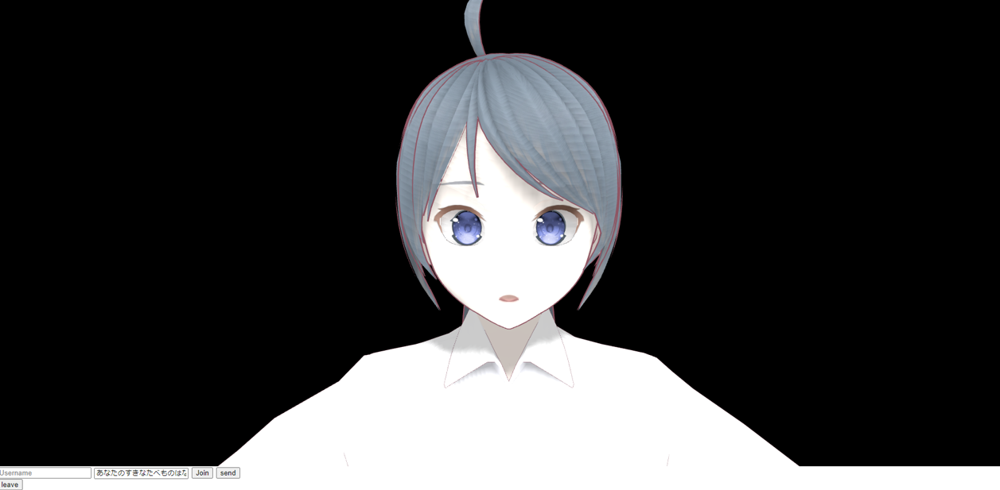

# Chat-with-either-AI-or-human-matching

２分の１の確率でAIか人間にマッチするチャットアプリです。需要がありそうだったら今後はAIのふりをした人間かもしくは、AIかを判断するゲームにする予定です。

# サンプル画像

# 特徴

音声入力で相手にメッセージを送り、３Dアバターが相手から送られてきたメッセージを読み上げてくれます。

# 必要なライブラリ
## Python
* openai
* Flask
* Flask-SocketIO

## JavaScript
* Three.js

# 必要なファイルデータ
## 3Dモデルのデータ
* vroid studioというソフトから3Dアバターを制作しVroid2Pmx ver2.01.05というソフトを使いモデルのファイル形式をpmxに変えてください。
* vroid studioでアバターの伸長を変更した場合うまくWEBサイトの画面にうまく描画されなくなる可能性があります。
* staticフォルダにMMDフォルダを作り3DモデルのデータpmxファイルとPmxTailorSetting,texフォルダを入れてださい
* mmdSetting.jsファイルの86行目に設定したpmxファイルの名前を入力してください

## Three.js
* index.htmlのimportmapに従いThree.jsのファイルを入れてください
  
# 遊び方
* 相手と名前が被らないようにuserNameを設定しjoinボタンをクリックしてください。
* WEB側のコンソールログでuserNameが入室しましたと出ればマッチング成功です。またtrueと表示されいればAIとマッチングしています。
* マイクがあればしゃべることによって音声入力をし相手にメッセージを送ります。一定時間しゃべらなければ音声入力の機能がOFFになってしまいます。
* またuserNameを設定する隣の入力欄にメッセージを入れてsendボタンを押すことによってメッセージを送信できます。
* leaveボタンを押すことによってチャットが終了します。

# Author

* NKMAK
